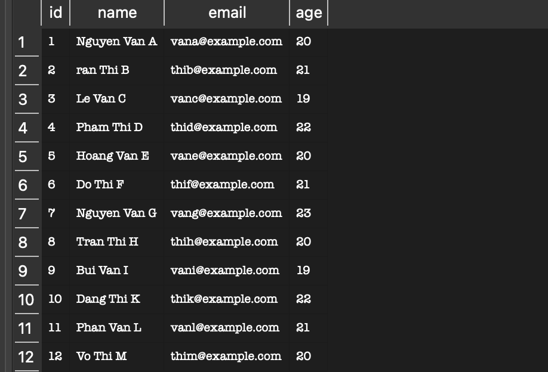
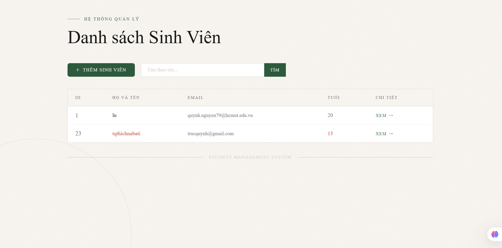
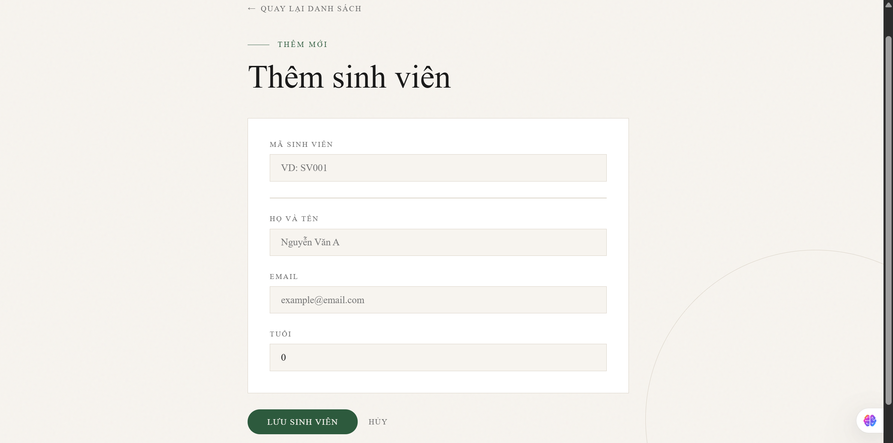
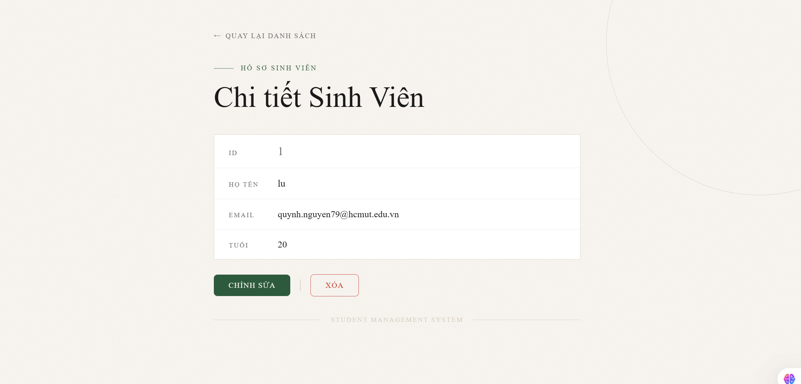

# Student Management System  

---

# Danh sách nhóm
Nguyễn Ngọc Trúc Quỳnh - 2312912

# Hướng dẫn cách chạy dự án
## Yêu cầu môi trường
Trước khi chạy, cần cài đặt:

Java 17
Maven 3.9+
(Tuỳ chọn) Docker nếu muốn build bằng container

## Clone source code

```
git clone <repository-url>
cd student-management
```

## CẤU HÌNH POSTGRESQL BẰNG BIẾN MÔI TRƯỜNG (ENV)
Thêm các biến môi trường để kết nối với database 
```
POSTGRES_HOST=...
POSTGRES_PORT=...
POSTGRES_DB=...
POSTGRES_USER=...
POSTGRES_PASSWORD=...
```
## Cách ứng dung dùng Docker

1) Build image
```
docker build -t student-management .
```

2) Run container với .env
Chạy container với các biến môi trường trong file .env 
```
docker run -p 8080:8080 --env-file .env student-management
```
## Truy cập

Truy cập ứng dụng tại:
```
http://localhost:8080/students
```

# Lab 1 – Trả lời câu hỏi

## 1. Dữ liệu lớn:


## 2. Ràng buộc Khóa Chính (Primary Key)

Khi cố tình thêm một sinh viên có `id` trùng với sinh viên đã tồn tại, Database báo lỗi:

duplicate key value violates unique constraint

### Giải thích

- `id` là Primary Key  
- Primary Key phải duy nhất và không được NULL  
- Database chặn để đảm bảo tính toàn vẹn dữ liệu  
- Nếu cho phép trùng ID, hệ thống sẽ không thể xác định chính xác bản ghi khi UPDATE hoặc DELETE  

---

## 3. Toàn vẹn dữ liệu (Constraints)

Khi thử thêm sinh viên nhưng để trống cột `name`:

- Nếu không có `NOT NULL` constraint → Database không báo lỗi  
- Điều này có thể gây lỗi trong Java như `NullPointerException`  
- Giao diện hiển thị thiếu thông tin  

### Giải pháp

Trong Entity nên khai báo:

@Column(nullable = false)
private String name;

---

## 4. Cấu hình Hibernate

Nếu cấu hình:

spring.jpa.hibernate.ddl-auto=create  
hoặc  
spring.jpa.hibernate.ddl-auto=create-drop  

Thì mỗi lần restart ứng dụng:

- Hibernate sẽ xóa bảng cũ  
- Tạo lại bảng mới  
- Dữ liệu bị mất  

### Cấu hình đúng để giữ dữ liệu

spring.jpa.hibernate.ddl-auto=update  

---

# Lab 4 – Ảnh giao diện

## 1. Trang danh sách sinh viên  


## 2. Trang thêm sinh viên  


## 3. Trang xem chi tiết sinh viên  

---

# Lab 5 – Link Deploy

Ứng dụng đã được deploy tại:
https://student-management-uxx0.onrender.com/

---
